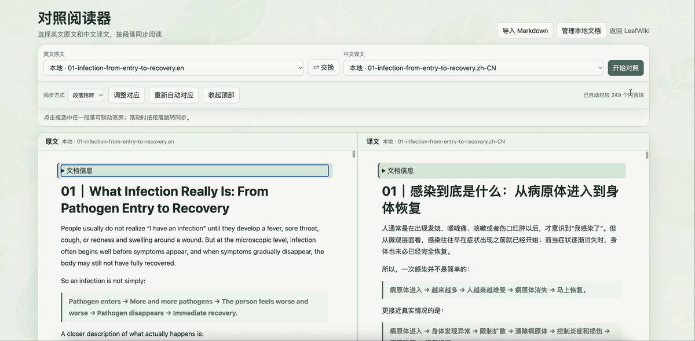
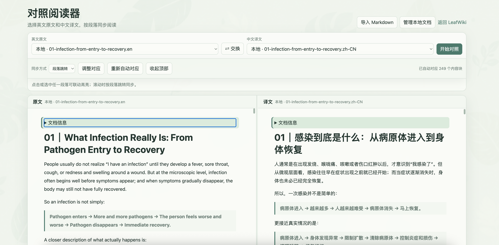

# Parallel Reader · 对照阅读器

一个轻量、自托管的双语 Markdown 对照阅读器。它可以只读加载现有 Markdown 目录，也可以导入本地 Markdown，在浏览器中进行左右对照阅读。

翻译由 ChatGPT 等外部工具完成；Parallel Reader 不调用翻译 API，也不需要 API Key。

## 功能

- 分别选择原文和译文，支持现有文档与本地导入文档混合配对。
- 按标题、段落、列表、引用、代码块和表格自动对应内容块。
- 段落跳转同步与双向高亮，避免中英文高度不同导致滚动抖动。
- 手动修正原文与译文的段落对应关系。
- 每个文档组合独立保存段落映射和阅读位置。
- 一次导入多个 UTF-8 Markdown；单个文件上限 10 MiB。
- 本地文档支持覆盖确认、改名和永久删除。
- 阅读时可收起顶部工具区，获得接近全屏的双栏视图。
- 桌面端拖动分隔线调整左右宽度，范围为 25%–75%；双击恢复各半。
- 手机端自动切换为上下布局。
- 无前端构建步骤；Markdown 渲染器随项目部署，不依赖 CDN。

## 效果预览

### 双栏同步阅读



### 完整界面



## 快速开始

需要 Docker 和 Docker Compose。

```bash
mkdir -p data documents
docker compose up -d
```

默认情况下，Compose 使用以下宿主机目录：

- 只读 Markdown：`/data/leafwiki/root`
- Reader 数据：`/data/parallel-reader`

在普通电脑上运行时，可以通过环境变量改为当前目录：

```bash
LEAFWIKI_DOCUMENTS_PATH="$PWD/documents" \
READER_DATA_PATH="$PWD/data" \
docker compose up -d
```

然后访问：

```text
http://localhost:8084
```

Reader 数据目录包含：

```text
data/
├── reader.db       # 文档配对、段落映射和阅读进度
└── documents/      # 从浏览器导入的 Markdown
```

挂载到 `/documents` 的外部 Markdown 始终为只读；应用只会管理自身 `/data/documents` 中的文件。

## 反向代理

应用自身监听容器端口 `8080`，Compose 默认映射到宿主机 `127.0.0.1:8084`。如果通过公网访问，请在反向代理层配置 HTTPS 和身份认证，不要直接公开后端端口。

前端资源与 API 使用相对地址，因此可以部署在域名根路径或反向代理子路径下。页面中的“返回 LeafWiki”链接默认指向同一域名的 `/notes/`。

## 项目结构

```text
parallel-reader/
├── app.py
├── compose.yaml
├── LICENSE
├── THIRD_PARTY_NOTICES.md
├── docs/
│   └── images/
│       ├── parallel-reader-demo.gif
│       └── parallel-reader-overview.png
└── static/
    ├── index.html
    ├── style.css
    ├── app.js
    ├── marked.min.js
    └── leaf-background.jpg
```

后端仅使用 Python 标准库和 SQLite。`marked.min.js` 固定为 Marked 15.0.12；许可信息见 [THIRD_PARTY_NOTICES.md](THIRD_PARTY_NOTICES.md)。

## 轻量检查

```bash
python -m py_compile app.py
docker compose config -q
curl -fsS http://127.0.0.1:8084/healthz
```

## 数据与备份

需要备份的是 Reader 数据目录，其中包括 `reader.db` 和导入的 Markdown。重建容器时不要删除该目录。

## License

[MIT](LICENSE)
